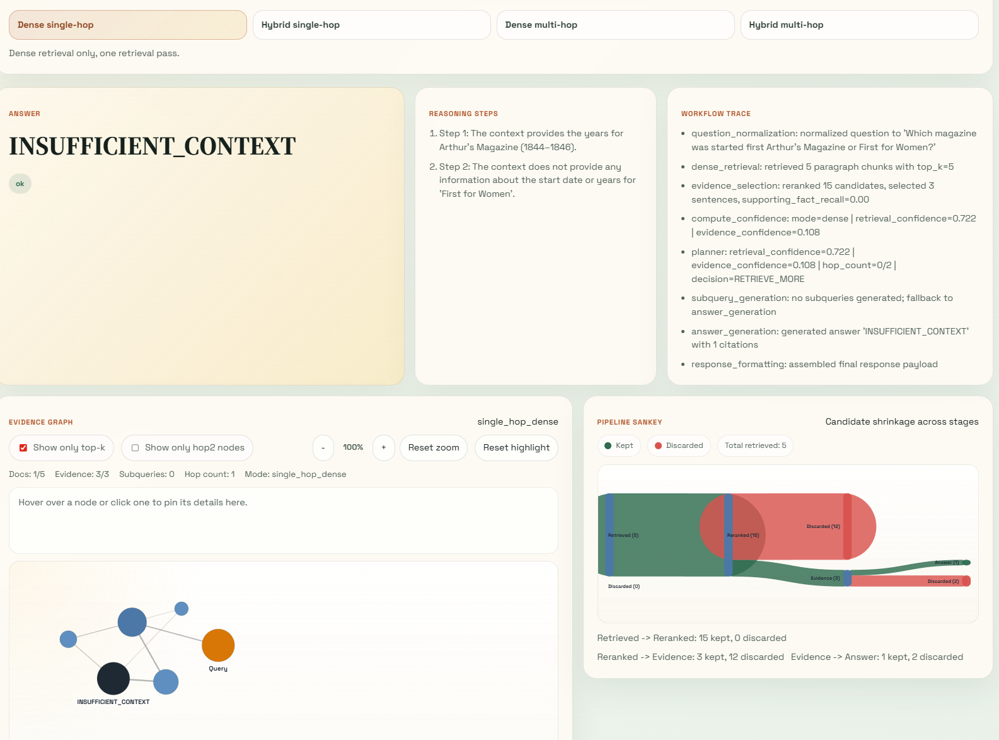
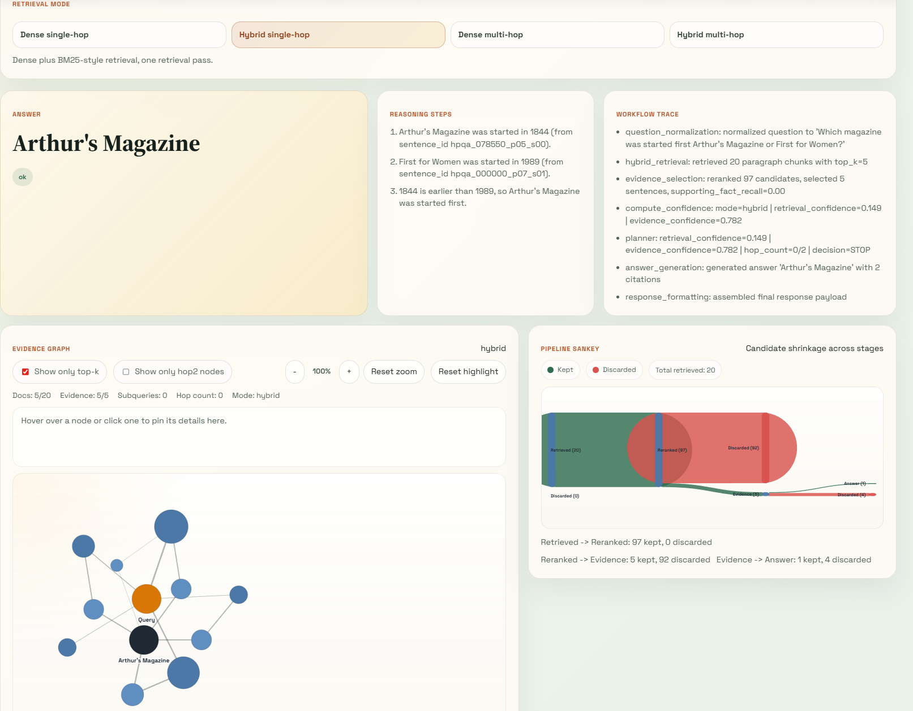
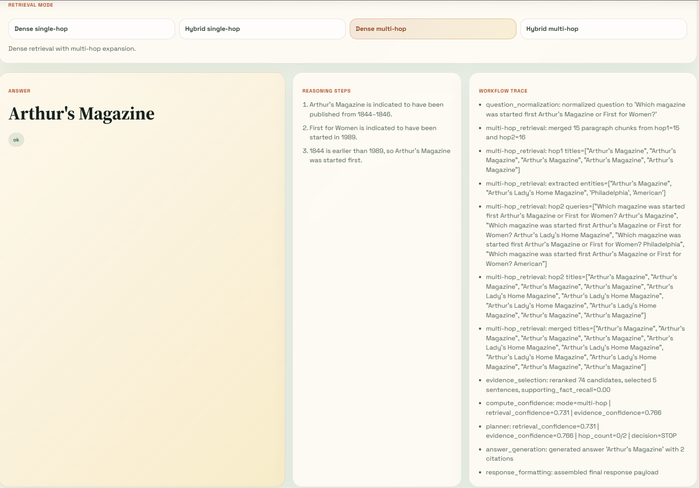
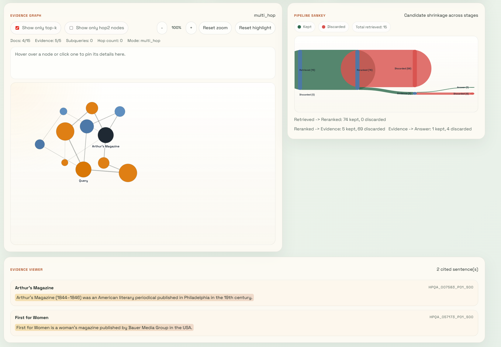
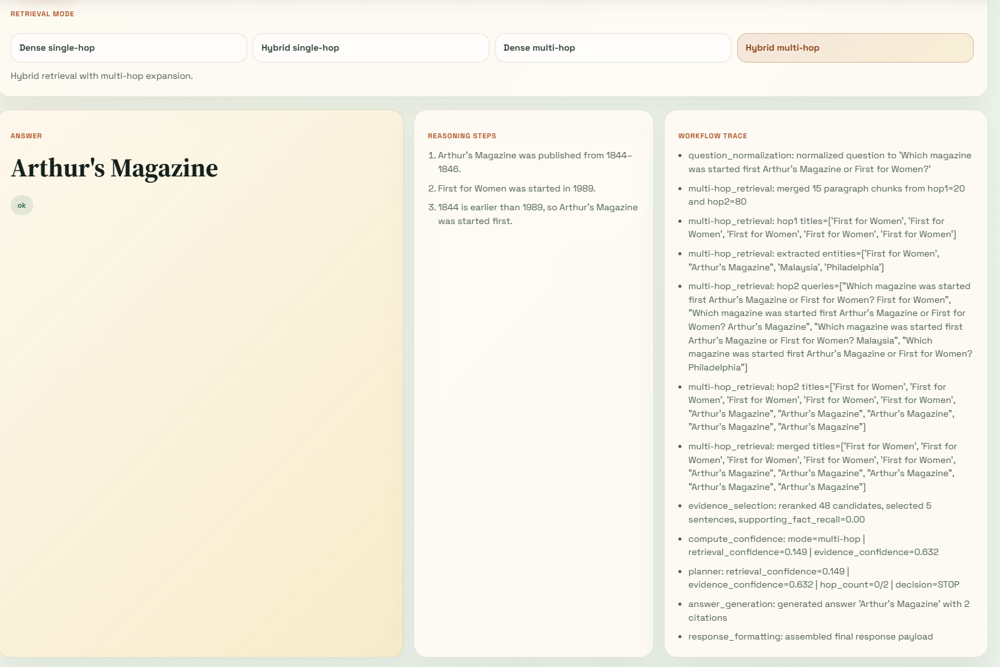
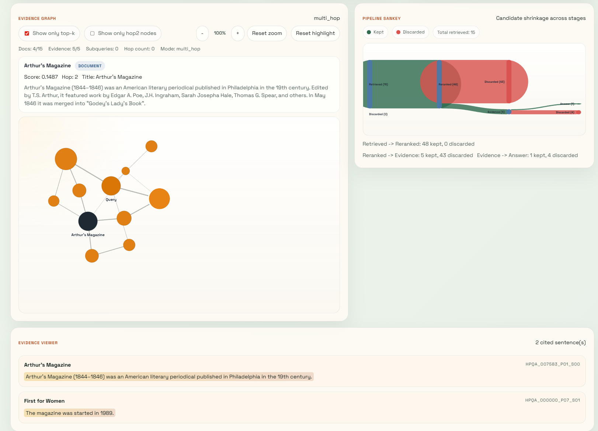

# Autonomous Multi-hop Research Agent

I built this project as an end-to-end multi-hop question answering system over HotpotQA. My goal was to move beyond a plain retrieval demo and build something that shows retrieval, evidence grounding, LLM synthesis, orchestration, evaluation, and a usable frontend in one system.

The project started as a dense-retrieval RAG pipeline and then grew into a more complete research agent with iterative retrieval, hybrid retrieval, failure analysis, and a dashboard that exposes the retrieval process itself.

## Architecture

```text
User Query
   |
   v
Question Normalization
   |
   v
Retrieval Layer
   |-- dense retrieval
   |-- optional hybrid retrieval (dense + BM25 + title boosts)
   |-- optional multi-hop expansion
   |-- optional graph retrieval (supporting-fact co-occurrence graph)
   v
Sentence-Level Evidence Selection
   |
   v
Grounded LLM Answer Generation
   |
   v
LangGraph Workflow
   |
   +--> Evaluation
   +--> FastAPI /ask
   +--> React UI
```

## What I Built

- **Corpus pipeline**: I used the HotpotQA `distractor` setting and flattened it into question, paragraph, and sentence parquet files with stable IDs.
- **Dense retrieval baseline**: I indexed paragraph chunks with `sentence-transformers/all-MiniLM-L6-v2` and FAISS.
- **Evidence selection**: I ranked candidate sentences from retrieved paragraphs and compared them against HotpotQA supporting facts.
- **Grounded generation**: I integrated an OpenAI-compatible LLM client and forced the answering stage to use only retrieved evidence.
- **Workflow orchestration**: I wrapped the pipeline in LangGraph so the system runs as a structured workflow rather than a loose script chain.
- **Evaluation**: I added answer metrics, supporting-fact metrics, failure breakdowns, and controlled comparisons across retrieval modes.
- **Frontend**: I added a React dashboard that now exposes a retrieval mode matrix, a workflow trace, an evidence viewer, a candidate-shrinkage Sankey, and an interactive retrieval graph so the retrieval process is visible rather than hidden behind a single final answer.

## Design Process

I built this in stages so each layer was working before I added the next one.

1. I started with a clean data pipeline over HotpotQA so I had traceable paragraph and sentence IDs.
2. I built a simple dense retriever first and validated it before adding more complexity.
3. I added sentence-level evidence selection so I could score supporting facts, not just final answers.
4. I added grounded answer generation with a fail-closed path when evidence was missing.
5. I moved the pipeline into LangGraph so the system was modular and easier to extend.
6. After the dense baseline was stable, I tried iterative multi-hop retrieval.
7. When retrieval failure was still too high, I added a hybrid retrieval path with dense search, BM25-style lexical search, and title-aware boosts.
8. I used evaluation results to decide what to improve next instead of guessing.

That progression matters because most of the later upgrades reuse the earlier modules rather than replacing them.

## System Design

- **Corpus**: HotpotQA `distractor` split flattened into question, paragraph, and sentence parquet files with stable IDs for traceability.
- **Retrieval**: paragraph-level dense retrieval using `sentence-transformers/all-MiniLM-L6-v2` and FAISS inner-product search over normalized embeddings, plus optional hybrid retrieval and optional two-hop expansion.
- **Evidence Selection**: sentence ranking inside retrieved paragraphs using query-to-sentence similarity plus a light parent-paragraph score boost.
- **Grounded Generation**: an OpenAI-compatible chat client, defaulted to DeepSeek, that is only allowed to answer from provided context.
- **Orchestration**: LangGraph nodes for normalization, retrieval, evidence selection, generation, and response formatting.
- **Evaluation**: answer EM/F1 and supporting-fact precision/recall/F1, plus retrieval/evidence/generation failure breakdowns.
- **Serving**: FastAPI backend with a React/Vite frontend.

## Retrieval Modes

One thing I wanted the interface to make explicit was that this project is not just "one RAG pipeline." I now expose a retrieval matrix in the frontend and API:

1. **Dense single-hop**
   - One dense retrieval pass over the FAISS paragraph index.
   - This is the simplest baseline and the easiest mode to interpret.

2. **Hybrid single-hop**
   - One retrieval pass that combines dense retrieval with BM25-style lexical matching and title-aware boosts.
   - This mode usually improves recall when exact names or titles matter.

3. **Graph single-hop**
   - A graph traversal seeded by HotpotQA supporting-fact co-occurrence.
   - This is the new graph backbone for questions where title relationships matter more than raw embedding similarity.

4. **Dense multi-hop**
   - A dense first hop followed by follow-up retrieval over bridge entities or generated subqueries.
   - I use this mode to probe whether iterative retrieval adds missing support pages that single-hop misses.

5. **Hybrid multi-hop**
   - A multi-hop retriever that uses the hybrid retriever as its base instead of dense-only retrieval.
   - In practice, this is the broadest lexical-plus-dense setting in the project.

6. **Graph multi-hop**
   - A second graph traversal step over the supporting-fact graph.
   - This is the broadest graph-centric retrieval setting in the project.

I think of these as six controlled variants of the same downstream grounded QA system rather than six unrelated models. That mattered to me because I wanted comparisons to reflect retrieval changes, not a totally different answer generator each time.

## Current Corpus And Artifacts

I rebuilt the full HotpotQA `distractor` artifacts from the full dataset.

- Questions: `90447`
- Paragraphs: `899667`
- Sentences: `3703344`
- Embedding model: `sentence-transformers/all-MiniLM-L6-v2`
- Embedding dimension: `384`

Processed data:

- `data/processed/hotpotqa_distractor/questions.parquet`
- `data/processed/hotpotqa_distractor/paragraphs.parquet`
- `data/processed/hotpotqa_distractor/sentences.parquet`

Retrieval artifacts:

- `artifacts/retrieval/hotpotqa_distractor/paragraph_index.faiss`
- `artifacts/retrieval/hotpotqa_distractor/paragraph_metadata.parquet`
- `artifacts/retrieval/hotpotqa_distractor/retrieval_metadata.json`
- `artifacts/retrieval/hotpotqa_distractor/paragraph_bm25.sqlite`

`retrieval_metadata.json` currently stores:

```json
{
  "model_name": "sentence-transformers/all-MiniLM-L6-v2",
  "embedding_dimension": 384,
  "chunk_count": 899667,
  "index_file": "paragraph_index.faiss",
  "metadata_file": "paragraph_metadata.parquet"
}
```

## Repository Layout

```text
.
|-- environment.yml
|-- requirements.txt
|-- README.md
|-- RUN_COMMANDS.txt
|-- Dockerfile
|-- docker-compose.yml
|-- scripts/
|   |-- preprocess_hotpotqa.py
|   |-- build_retrieval_index.py
|   |-- compare_dense_vs_hybrid.py
|   |-- compare_retrieval_modes.py
|   |-- validate_retrieval.py
|   |-- validate_evidence_selection.py
|   |-- validate_multi_hop_retrieval.py
|   |-- validate_rag.py
|   |-- run_workflow.py
|   |-- evaluate_pipeline.py
|   `-- run_api.py
|-- src/
|   `-- autonomous_multi_hop_research_agent/
|       |-- api.py
|       |-- config.py
|       |-- data_pipeline.py
|       |-- evaluation.py
|       |-- evidence.py
|       |-- hybrid_retrieval.py
|       |-- multi_hop_retrieval.py
|       |-- rag.py
|       |-- retrieval.py
|       `-- workflow.py
`-- frontend/
    `-- src/
```

## Setup

### 1. Create The Conda Environment

```powershell
conda env create -f environment.yml
conda activate .\.conda\envs\autonomous-multi-hop-research-agent
```

I used a path-based conda environment in this repo, so activating by path is the safest option on this machine.

### 2. Install The Known Working GPU PyTorch Build

I validated this project with pip-installed CUDA wheels, not conda PyTorch:

```powershell
pip uninstall -y torch torchvision torchaudio
pip install torch==2.6.0+cu124 torchvision==0.21.0+cu124 torchaudio==2.6.0+cu124 --index-url https://download.pytorch.org/whl/cu124
python -c "import torch; print(torch.cuda.is_available(), torch.version.cuda, torch.__version__)"
```

Expected output:

```text
True 12.4 2.6.0+cu124
```

### 3. Configure Environment Variables

Create `.env` from `.env.example` and set your provider key:

```powershell
DEEPSEEK_API_KEY=<your key>
LLM_API_BASE_URL=https://api.deepseek.com
LLM_MODEL=deepseek-chat
```

### 4. Windows Note

On this Windows setup, some `torch` and `sentence-transformers` runs needed:

```powershell
$env:KMP_DUPLICATE_LIB_OK="TRUE"
```

I also had to be careful about import order and local DLL resolution in a few validation scripts. The repo scripts now handle the Windows runtime setup where it mattered.

## Running The Pipeline

### Stage 0 Validation

```powershell
python scripts/validate_setup.py
```

### Stage 1: Preprocess Full HotpotQA Distractor

```powershell
python scripts/preprocess_hotpotqa.py
```

Outputs:

- `data/processed/hotpotqa_distractor/questions.parquet`
- `data/processed/hotpotqa_distractor/paragraphs.parquet`
- `data/processed/hotpotqa_distractor/sentences.parquet`

### Stage 2: Build Retrieval Index

```powershell
python scripts/build_retrieval_index.py
```

### Stage 2 Validation

```powershell
python scripts/validate_retrieval.py --top-k 5 --num-questions 3
```

### Stage 3 Validation

```powershell
python scripts/validate_evidence_selection.py --retrieval-top-k 5 --evidence-top-k 5 --num-questions 3
```

### Stage 4 Validation

```powershell
python scripts/validate_rag.py --question-index 0 --retrieval-top-k 5 --evidence-top-k 5
```

### Stage 5 Workflow

```powershell
python scripts/run_workflow.py --question "Which magazine was started first Arthur's Magazine or First for Women?"
```

To force the old dense-only single-hop path:

```powershell
python scripts/run_workflow.py --single-hop --question "Which magazine was started first Arthur's Magazine or First for Women?"
```

To enable hybrid retrieval in the workflow CLI:

```powershell
python scripts/run_workflow.py --hybrid --question "Which magazine was started first Arthur's Magazine or First for Women?"
```

### Stage 6 Evaluation

```powershell
python scripts/evaluate_pipeline.py --num-examples 250 --seed 42 --retrieval-top-k 5 --evidence-top-k 5
```

### Multi-hop Retrieval Validation

```powershell
python scripts/validate_multi_hop_retrieval.py --num-queries 20 --search-limit 200 --seed 42 --single-hop-top-k 10 --final-top-k 15
```

### Single-hop vs Multi-hop Comparison

```powershell
python scripts/compare_retrieval_modes.py --num-examples 100 --seed 42 --retrieval-top-k 15 --evidence-top-k 5
```

### Dense vs Hybrid Comparison

```powershell
python scripts/compare_dense_vs_hybrid.py --num-examples 100 --seed 42 --retrieval-top-k 20 --evidence-top-k 5
```

## Key Safety Behaviors

- If retrieval returns nothing useful, the system can return `INSUFFICIENT_CONTEXT` instead of guessing.
- Citation validation fails closed if the model cites sentence IDs that were not actually selected.
- The workflow supports `use_multi_hop=True/False` and `use_hybrid_retrieval=True/False`, so I can compare retrieval strategies under the same downstream pipeline.

## Benchmark History

All runs below were executed in this project during development. When a run says `single-hop`, it used the original retrieval path. When a run says `multi-hop`, it used the iterative two-hop retriever. When a run says `hybrid`, it used dense retrieval plus BM25-style lexical retrieval plus title boosts.

### 1. Early Stage 6 Subset Check

Setup:
- Full processed corpus
- Early Stage 6 validation run
- 10-example subset
- Single-hop

Metrics:

- Answer EM: `0.3000`
- Answer F1: `0.3500`
- Supporting precision: `0.4000`
- Supporting recall: `0.2000`
- Supporting F1: `0.2467`
- Insufficient-context rate: `0.0000`

### 2. Dev Benchmark, 250 Queries

Setup:
- HotpotQA `validation` / dev
- 250 queries
- seed `42`
- `retrieval_top_k=5`
- `evidence_top_k=5`
- Single-hop

Metrics:

- Answer EM: `0.15`
- Answer F1: `0.20`
- Supporting precision: `0.44`
- Supporting recall: `0.27`
- Supporting F1: `0.32`
- Insufficient-context rate: `0.00`
- retrieval_failure: `89.60%`
- evidence_failure: `3.60%`
- generation_failure: `2.80%`

### 3. Dev Benchmark, 100 Queries, Wider Retrieval

Setup:
- HotpotQA `validation` / dev
- 100 queries
- seed `42`
- `retrieval_top_k=15`
- `evidence_top_k=5`
- Single-hop

Metrics:

- Answer EM: `0.17`
- Answer F1: `0.22`
- Supporting precision: `0.47`
- Supporting recall: `0.29`
- Supporting F1: `0.34`
- Insufficient-context rate: `0.02`
- retrieval_failure: `85.00%`
- evidence_failure: `8.00%`
- generation_failure: `5.00%`

### 4. Single-hop vs Multi-hop A/B Comparison

Setup:
- HotpotQA `validation` / dev
- same 100 queries
- same seed `42`
- same LLM
- same evidence settings
- `retrieval_top_k=15`
- `evidence_top_k=5`

Single-hop:

- Answer EM: `0.17`
- Answer F1: `0.22`
- Supporting precision: `0.46`
- Supporting recall: `0.28`
- Supporting F1: `0.33`
- Insufficient-context rate: `0.04`
- retrieval_failure: `85.00%`
- evidence_failure: `8.00%`
- generation_failure: `5.00%`

Multi-hop:

- Answer EM: `0.16`
- Answer F1: `0.21`
- Supporting precision: `0.42`
- Supporting recall: `0.26`
- Supporting F1: `0.31`
- Insufficient-context rate: `0.03`
- retrieval_failure: `84.00%`
- evidence_failure: `9.00%`
- generation_failure: `5.00%`

Summary:

- EM: `0.17 -> 0.16`
- F1: `0.22 -> 0.21`
- Evidence precision: `0.46 -> 0.42`
- Evidence recall: `0.28 -> 0.26`
- Evidence F1: `0.33 -> 0.31`
- Retrieval failure: `85.00% -> 84.00%`

Takeaway:

- The current multi-hop retriever reduced retrieval failure slightly.
- In the form I tested here, that gain did not yet improve overall QA metrics.

### 5. Retrieval-only Multi-hop Validation

This was not a full answer-generation benchmark, but it mattered because it showed the multi-hop behavior itself was real.

Setup:
- HotpotQA dev sample
- 20 printed queries
- seed `42`
- search scan widened to `200` sampled queries to find a concrete hop-2 improvement example

Observed result:
- Hop 2 successfully added a missing gold document for:
  `What is the name of shipping magnate Mærsk Mc-Kinney Møller' father?`
- Added missing gold title: `Møller Centre`

Important note:
- There was no separate 200-query end-to-end QA benchmark in this thread.
- The `200` figure refers to the retrieval validation scan window used to find a hop-2 improvement example.

### 6. Dense vs Hybrid Retrieval A/B Comparison

Setup:
- HotpotQA `validation` / dev
- same 100 queries
- same seed `42`
- same LLM
- same evidence settings
- `retrieval_top_k=20`
- `evidence_top_k=5`
- `use_multi_hop=False`

Dense-only:

- Answer EM: `0.17`
- Answer F1: `0.23`
- Supporting precision: `0.46`
- Supporting recall: `0.28`
- Supporting F1: `0.34`
- Insufficient-context rate: `0.03`
- retrieval_failure: `83.00%`
- evidence_failure: `10.00%`
- generation_failure: `4.00%`

Hybrid:

- Answer EM: `0.19`
- Answer F1: `0.25`
- Supporting precision: `0.47`
- Supporting recall: `0.28`
- Supporting F1: `0.34`
- Insufficient-context rate: `0.13`
- retrieval_failure: `69.00%`
- evidence_failure: `23.00%`
- generation_failure: `4.00%`

Summary:

- EM: `0.17 -> 0.19`
- F1: `0.23 -> 0.25`
- Evidence recall: `0.28 -> 0.28`
- Retrieval failure: `83.00% -> 69.00%`

Takeaway:

- Hybrid retrieval clearly improved coverage.
- It also pushed more failures downstream into evidence selection, which means retrieval improved faster than the sentence-ranking stage.

## API

Start the backend:

```powershell
python scripts/run_api.py
```

Endpoints:

- `GET http://127.0.0.1:8000/health`
- `POST http://127.0.0.1:8000/ask`

Example request:

```powershell
curl -X POST http://127.0.0.1:8000/ask `
  -H "Content-Type: application/json" `
  -d "{\"question\":\"Which magazine was started first Arthur's Magazine or First for Women?\",\"retrieval_top_k\":5,\"evidence_top_k\":5,\"use_hybrid_retrieval\":true,\"use_multi_hop\":false}"
```

Example response shape:

```json
{
  "answer": "Arthur's Magazine",
  "reasoning": ["..."],
  "evidence": [
    {
      "sentence_id": "hpqa_000000_p05_s00",
      "title": "Arthur's Magazine",
      "sentence_index": 0,
      "sentence_text": "Arthur's Magazine (1844-1846) was an American literary periodical..."
    }
  ],
  "status": "ok",
  "metadata": {
    "failure_reason": "",
    "use_multi_hop": "False",
    "use_hybrid_retrieval": "True"
  },
  "retrieval_debug": {
    "mode": "hybrid",
    "dense_titles": [],
    "bm25_titles": [],
    "merged_titles": [],
    "title_boosts": []
  },
  "execution_trace": ["question_normalization: ..."]
}
```

The API fails closed when evidence is missing or citation validation fails.

## Frontend

Install and run the React app:

```powershell
cd frontend
npm install
npm run dev
```

Default frontend URL:

- `http://127.0.0.1:5173`

The frontend is wired to the backend through `VITE_API_BASE_URL`, which defaults to `http://127.0.0.1:8000`.

What the dashboard currently shows:

- question input
- explicit retrieval-mode matrix for all six retrieval variants
- answer display
- reasoning steps
- workflow execution trace
- evidence viewer with highlighted citations
- retrieval graph with hover inspection, zoom controls, and mode-aware graph summaries
- pipeline Sankey showing how many candidates survive each stage
- retrieval debug information exposed through mode-specific workflow traces

## Current Frontend Improvements

I recently revised the frontend to make the retrieval side of the system easier to interpret during demos and debugging.

- I replaced the older checkbox-style retrieval controls with an explicit retrieval-mode matrix.
- I added an evidence graph that lets me inspect the relationship between the query, retrieved documents, selected evidence, and the final answer.
- I added a pipeline Sankey so I can see how many candidates survive retrieval, reranking, evidence selection, and final answer generation.
- I tightened the layout so the dashboard uses horizontal space better and reads more like a research instrument than a toy demo.
- I also spent some time fixing Windows runtime issues and retrieval-mode routing so the backend behavior now matches what the frontend says it is running.

## Dashboard Screenshots

For the comparison screenshots below, I used the same question across the retrieval matrix:

`Which magazine was started first Arthur's Magazine or First for Women?`

I wanted this section to function like a small controlled qualitative comparison, so the point is not that the UI looks different for unrelated prompts. The point is that I can hold the query fixed and show how retrieval behavior, workflow trace content, evidence quality, and candidate shrinkage change as I move across dense, hybrid, and graph backbones with single-hop and multi-hop variants.

### Landing View

This is the current landing state before a query is submitted. I wanted the interface to feel lightweight and readable, but still clearly present the system as an inspectable research workflow rather than a plain chat box.


### Dense Single-Hop

This is the dense single-hop baseline on that shared comparison query. In this mode the system makes one dense retrieval pass and either answers from the retrieved evidence or fails closed if the context is not good enough.



The corresponding dense single-hop retrieval graph and Sankey view:


### Hybrid Single-Hop

This is the hybrid single-hop result for the same question. Here I combine dense retrieval with BM25-style lexical retrieval and title boosts before evidence selection. This has been the most reliable single-hop mode in my experiments so far.



### Dense Multi-Hop

This is the dense multi-hop result for the same question. The retrieval trace becomes more interesting here because the system now tries to expand beyond the first hop rather than trusting the initial dense retrieval set.



The dense multi-hop graph and Sankey view:



### Hybrid Multi-Hop

This is the hybrid multi-hop result for the same question, which is one of the broadest retrieval settings currently exposed in the project. In this mode I combine lexical-plus-dense retrieval with iterative expansion, then let the evidence selector compress that larger candidate set back down to grounded evidence.



The hybrid multi-hop graph and Sankey view:



### What The Four-Mode Comparison Shows

Holding the question fixed made a few patterns easier for me to explain.

- **Dense single-hop** is the most brittle baseline and is the most likely to fail closed when the first retrieval pass misses a key comparison fact.
- **Hybrid single-hop** usually improves coverage because lexical overlap helps recover the named entities directly.
- **Dense multi-hop** is interesting when the first hop exposes a bridge entity, but it can still be noisy if the follow-up expansion is weak.
- **Hybrid multi-hop** gives me the broadest candidate pool, and the Sankey is especially helpful there because it shows how much of that pool gets discarded by evidence selection.

### Why I Added These Views

From a grad-student project perspective, the visualizations matter because they let me show where the system is succeeding or failing without pretending retrieval is a black box.

- The **workflow trace** shows the exact sequence of orchestration decisions.
- The **evidence graph** gives me a compact visual summary of how retrieved documents connect to evidence and then to the answer.
- The **pipeline Sankey** makes candidate shrinkage visible, which is useful when retrieval improves but evidence selection still becomes the bottleneck.
- The **evidence viewer** lets me inspect the actual cited sentences instead of only trusting the model's final prose.

## Optional Docker Setup

This repo includes a lightweight backend container definition for local packaging. I treated it as an optional convenience layer, not as the main part of the project.

Build:

```powershell
docker build -t autonomous-multi-hop-research-agent .
```

Run:

```powershell
docker compose up --build
```

The container exposes the API on port `8000`.

## Tradeoffs

- Paragraph retrieval is easier to build and debug than a more complex document graph, but it misses some bridge cases.
- The current multi-hop retriever is modular and useful for bridge-page discovery, but its entity expansion is still heuristic and noisy.
- Hybrid retrieval improves coverage, but it also increases the burden on evidence ranking because more partially relevant candidates make it through.
- Sentence evidence selection still uses a heuristic score instead of a stronger reranker.
- I chose fail-closed grounding and citation validation because I would rather return `INSUFFICIENT_CONTEXT` than let the model bluff.

## Limitations

- Retrieval is still the dominant failure mode, even after adding multi-hop and hybrid retrieval.
- Evidence recall is still modest on questions where the gold support includes "setup" sentences rather than the most answer-like sentence.
- The current multi-hop retriever improves some retrieval cases, but in my latest A/B test it did not improve end-to-end QA metrics overall.
- Hybrid retrieval improves retrieval coverage, but the evidence selector is not yet strong enough to fully capitalize on that gain.
- The current evidence graph is useful for interpretation, but it is still a visualization of retrieval and evidence state rather than a true graph-native retrieval system.
- Backend network testing in this environment was more reliable through in-process validation than direct localhost socket testing.

## Future Updates I Have In Mind

- Add a stronger sentence or paragraph reranker after retrieval.
- Improve multi-hop query expansion so hop 2 is driven by better bridge entities.
- Improve evidence selection so it can take advantage of the broader candidate set from hybrid retrieval.
- Add a cleaner benchmark table and experiment log in the dashboard.
- Expand evaluation to larger subsets and more official Hotpot-style reporting.
- Add streaming responses and richer evidence highlighting in the frontend.
- Add a more stable graph interaction model with better panning, filtering, and mode comparison views.
- Add graph-based RAG later on so the project moves from graph visualization toward an actual graph-native retrieval method.
- Add Docker Compose services for the frontend and more polished local deployment.
